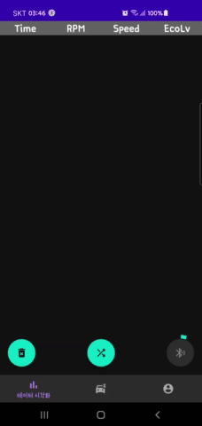

# 🚗 EgoEco-App

 

> EgoEco Demo Link : https://www.youtube.com/watch?v=zRmi8VhzT48

> EgoEco HomePage Link : https://egoeco.netlify.app/

## 📑 About

시내버스에서 볼 수 있는 에코시스템을 개인 차량에 적용해서 온실가스 배출량을 줄여보자!

개인 차량용 에코 시스템으로 연비를 높이는 운전을 할 수 있는 포인트 앱을 개발해보자!

## 📕 Detail

에고에코앱은 차량 운행 정보(엔진 RPM, 속도 등)를 측정해서 경제적인 운전 습관을 기를 수 있도록 도와주는 앱입니다.

에고에코앱 작동 과정은 아래와 같습니다.

1. 차량의 OBD2 단자를 이용하여 데이터를 읽어옵니다.

2. 데이터를 분석하여 차량이 연비 운전 중인지를 판단합니다.

3. 차량 운행 정보는 블루투스를 이용해 전송받아 앱을 통해 데이터 처리가 이루어집니다.

4. 앱에서 처리된 데이터를 서버로 보내고, 해당 데이터를 근거로 에코시스템 등급에 따라 포인트를 지급해줍니다.

4. 에코시스템으로 얻은 포인트는 사용자의 정보에 따라 구분되어 저장되고 포인트로 다양한 혜택을 받을 수 있습니다.

판단한 데이터 값을 토대로 포인트를 지급하여 사용자가 연비 운전이 수익을 창출할 수 있다는 마인드를 갖도록 만들 예정입니다.

웹 사이트를 통해서는 본인의 포인트가 얼마나 쌓였고 어떤 운전습관을 가졌는지를 확인할 수 있습니다.

저희가 개발한 ‘에고에코’가 운전습관을 개선시켜 대기환경을 바꿀 수 있다는 것을 알려줄 것입니다.

추가로 공공데이터를 이용하여 차량으로 인한 대기오염이 얼마나 심각한지 보여줄 것입니다.

## 👨‍👧‍👧 Benefit

저희가 개발한 에코 시스템 활성화 앱 ‘에고에코’ 실천으로 전국의 2,437만 대의 개인 차량이 약 7%씩 연료 절감이 이루어진다면, 절감한 연료만큼 온실 가스 배출량이 줄어들 것입니다. 이 효과는 현재 서울특별시와 대구광역시 시내버스에 에코 시스템을 적용해 7~16%의 연료 절감효과를 가져왔고, 연비 또한 1년 만에 2.06km/m -> 2.44km/m3로 향상된 결과값이 이미 나왔습니다. 연료소모를 줄이고 온실가스 배출량을 줄일 수 있는 에코시스템을 개인 차량에도 적용한다면 엄청난 효과를 지닐 것이라고 예상됩니다.

해당 기사 에 따르면 **자동차 1대당 평균 탄소 발자국은 53.8t입니다. 그리고 30년생 소나무 한 그루는 1년 동안 CO2를 6.6kg 흡수**합니다. 이 수치에 따라 전국의 2,437만 대의 개인 차량이 `에고에코 `앱을 통해 7% 연료 절감이 이루어진다면 약 139만 그루의 소나무를 심은 효과가 발생합니다. 따라서 `에고에코` 앱을 이용하는 사람이 많아질수록 온실 가스  감소 및 대기 환경 개선에 큰 도움이 될 것이라 예상합니다.

* 탄소발자국 기사 링크 : [Go to Link](https://www.mk.co.kr/news/world/view/2019/09/717844/)

** 소나무 CO2 흡수량 관련 링크 : [Go to Link](https://www.lafent.com/inews/news_view.html?news_id=108276)

## 💪 How it works

1. 차량 데이터 측정 모듈에서 측정한 데이터를 블루투스로 전송받는 기능
   

2. 블루투스로 받은 데이터를 app에 저장해 현재 주행 상태를 확인할 수 있는 기능

3. 웹, 앱 통합 회원 관리 서비스

### 🔎 Specification
- min SDK : 26
- Target SDK : 30
- Implement : RxAndroid, RxJava, RxLifeCycle, Glide, Navigation, Room, Bluetooth Adapter, Retrofit
- Keep on : AAC ViewModel, MVVM Pattern, Single Activity

## 📕 Primary To-do List
- [X] Design Application Structures & Design (done at 21.05.20)
- [X] Prepare MVVM Design with AAC ViewModel (done at 21.05.20)
- [X] Complete Data Model (done at 21.05.20)
- [X] Dependency Injection (done at 21.05.20)
- [ ] Implement Login with Retrofit -REST API
- [ ] Complete Login Activity
- [ ] Complete MyMenu Fragment
- [X] Complete OBD Data Fragment (done at 21.05.22)
- [X] Make RecyclerView for OBD Data (done at 21.05.20)
- [X] Make ListAdapter for Control RecyclerView (done at 21.05.20)
- [X] Connect with Bluetooth (done at 21.05.23)
- [X] Complete Bluetooth Service (done at 21.05.26)
- [X] Collect Log Data from Bluetooth and Apply it to RecyclerView (done at 21.05.26)
- [X] Register Bluetooth Broadcast Receiver (done at 21.05.28)
- [X] Implementation ViewModel-Service Broadcast & Control UI along with Bluetooth Service (done at 05.28)
- [X] Exception Handling When Socket Connection Failed (done at 05.29)
- [X] Import MPAndroidChart and Implement Line Chart (done at 21.05.22)
- [X] Complete Data Visualization Fragment (done at 21.05.22)

### 📘 Secondary To-do List
- [ ] Make UI Better Using Material Design and CustomView
- [ ] Add Dark/Light Theme
- [ ] Make User Choose Light/Night Theme

## 👏 Collaboration

EgoEco 앱 파트 오픈 소스 링크 : https://github.com/EgoEco/egoeco-app

EgoEco 임베디드 파트 오픈 소스 링크 : https://github.com/EgoEco/egoeco-Embedded

EgoEco 웹 프런트 파트 오픈 소스 링크 : https://github.com/EgoEco/egoeco-web

EgoEco 웹 백엔드 파트 오픈 소스 링크 : https://github.com/EgoEco/egoeco-server

EgoEco App 실행 영상 링크 : https://www.youtube.com/watch?v=of8lhPzJoZ8

## 📊 활용 데이터

공공 데이터 포털- 환경부 온실가스종합정보센터_가스별 국가 온실가스 인벤토리 배출량(CO2)

서울 열린데이터 광장 - 서울시 대기오염 (구별) 통계

서울 열린데이터 광장 - 서울시 승용차의 배기량별 등록 현황 통계

기상청 기상자료개방포털 - 온실가스

차량 속도별 배기 가스 배출량 관련 논문 링크 : http://www.ijhe.or.kr/journal/article.php?code=38502
